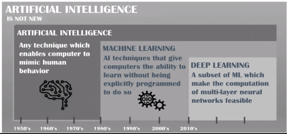
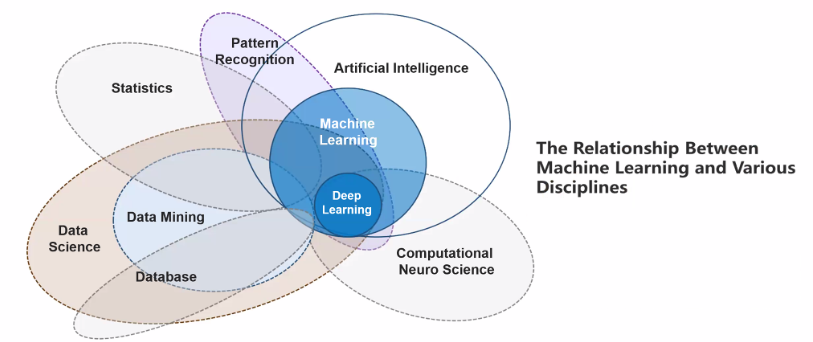
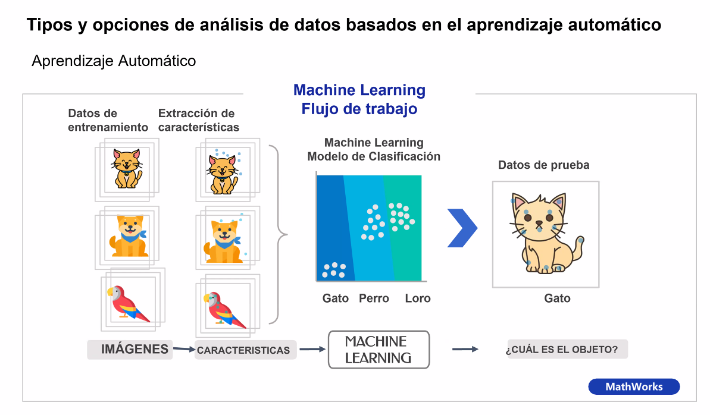
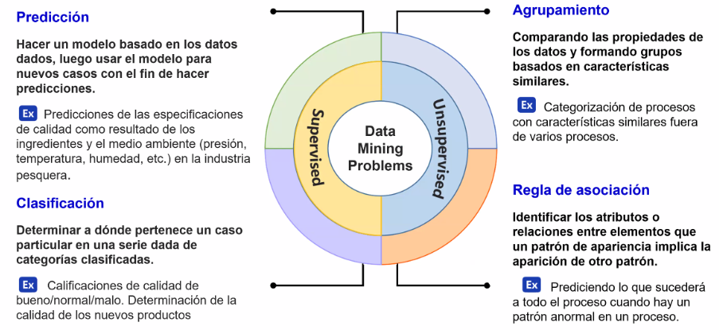
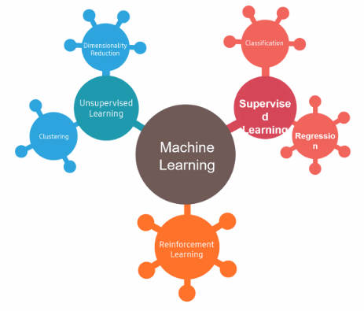
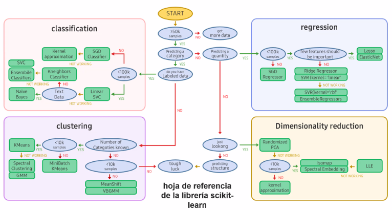

# Notas de la sesión 
## Antecedentes
>[!NOTE] Un poco de historia
>*John McCarthy* ideo el nombre de inteligencia artificial en 1955. Se definió como la capacidad de un programa de computadora o una máquina para pensar y aprender.
   Algunos nombres relevante para la IA: *John Hoppefield*, *Edward Feingbaum* y *Gary Kasparov* campeón mundial que perdió en mundial de ajedrez en 1997 contra la computadora *Deep Blue*
### Construir un sistema inteligente que transforme los datos en conocimiento
- Hay una abundancia de datos estructurados y no estructurados en la era tecnológica moderna.
- El aprendizaje automático surge a finales del siglo XX como un subcampo de la Inteligencia Artificial (IA) relacionado con algoritmos de autoaprendizaje que extraen y predicen el conocimiento de los datos.
 - Los humanos pueden analizar manualmente grandes cantidades de datos para deducir reglas y hacer modelos.
- El aprendizaje automático puede mejorar gradualmente los modelos de prevenci6n y la eficacia en la toma de decisiones basada en datos al extraer el conocimiento de los datos de manera 

>[!NOTE]  Subconjuntos de la IA: 
>	- Machine Learning
>	- Deep Learning
>	- IA
El Machine Learning es considerado como un campo de la inteligencia artificial y es el estudio de algoritmos informáticos que mejoran automáticamente miles de ejemplos y experiencias.
 "Es un campo de investigación que desarrolla algoritmos que permiten a las máquinas aprender de los datos y ejecutar acciones que no están especificadas explícitamente por código". Arthur Samuel, 1959.
### Disciplinas relacionadas al Aprendizaje Automático.
Estudios relacionados con el Aprendizaje Automático
- El aprendizaje automático es un campo interdisciplinario que combina los antecedentes académicos y los logros en diversos campos, como la probabilidad y la estadística, la informática, la teoría de bases de datos, la ciencia cognitiva, la neurociencia y el reconocimiento de patrones.

### Aprendizaje Automático vs. Estadística
- La **estadística** SE BASE EN **explicar lo bien que los datos se ajustan a la hipótesis y la teoría del investigador** (o con qué precisión los valores derivados de las observaciones estiman los parámetros de poblaciones reales).
- **Aprendizaje automático**: **resuelve tareas que son difíciles de diseñar o difíciles de programar con algoritmos explícitos**. **Cuantificar relaciones complejas mediante la identificación de las características de los mecanismos potenciales generados por los datos**, y luego para hacer **predicciones** sobre nuevos datos utilizando este patrón identificado.
- **Muchas metodologías de aprendizaje automático se basan en el aprendizaje estadístico basado en la estadística, aunque los dos parezcan muy diferentes.**
### Tipos y opciones de análisis de datos basados en el aprendizaje automático
#### Flujo de trabajo básico en el aprendizaje automático (clasificación de imágenes):

> [!NOTE] Explicación de la imagen
> - **Datos de Entrenamiento**: A la izquierda, se representan imágenes de gatos, perros y loros que se utilizarán como datos de entrenamiento. Estas imágenes son ejemplos de cada clase que el modelo aprenderá a reconocer.
> - **Extracción de Características**: Después de seleccionar los datos de entrenamiento, se extraen características relevantes de cada imagen. Estas características son patrones que ayudarán al modelo a diferenciar entre las categorías, como las formas, colores o texturas características de gatos, perros y loros.
> - **Modelo de Clasificación de Machine Learning**: En el centro, se muestra el proceso de machine learning en el que, usando las características extraídas, se entrena un modelo de clasificación que será capaz de distinguir entre gatos, perros y loros. Este modelo toma como entrada las características extraídas y aprende a clasificarlas en las categorías correctas.
> - **Datos de Prueba**: Una vez entrenado el modelo, se puede evaluar usando datos de prueba (una imagen de un gato en este caso). La imagen de prueba pasa por el modelo de clasificación para predecir la categoría a la que pertenece.
> - **Resultado**: El modelo identifica la imagen de prueba como un "Gato", demostrando que ha aprendido correctamente a clasificar los objetos.
#### Flujo de trabajo en Deep Learning (en el uso de redes neuronales artificiales):

> [!NOTE] Descripción de la imagen
> - **Imágenes de Entrenamiento**: A la izquierda, se ven imágenes de diferentes categorías (gatos y perros) que sirven como datos de entrenamiento para la red neuronal. Estas imágenes representan los ejemplos que la red usará para aprender a clasificar correctamente.
> - **Red Neuronal Artificial (ANN)**: En el centro, se muestra una red neuronal artificial, que es el modelo de aprendizaje profundo. Esta red consiste en **neuronas** interconectadas organizadas en varias capas. Cada capa procesa y transforma la información proveniente de la capa anterior, permitiendo a la red extraer características complejas de las imágenes de entrada.
> - **Neuronas y Cálculos Matemáticos**: Las conexiones y las neuronas (representadas como círculos) realizan cálculos matemáticos complejos (representados como "gran ecuación matemática") para interpretar y clasificar las características de las imágenes. Aunque las redes neuronales están inspiradas en el funcionamiento del cerebro humano, no replican exactamente cómo funciona un cerebro biológico.
> - **Predicción**: A la derecha, el resultado de la red neuronal es la predicción de la clase de la imagen, en este caso, “Cat” (gato). Esto significa que, tras el procesamiento de las características en cada capa, la red concluye que la imagen corresponde a un gato.

### Tipos de análisis de datos basados en el aprendizaje automático
Al analizar grandes cantidades de datos mediante la aplicación de tecnología de aprendizaje automático, se pueden encontrar patrones que no eran visibles, esto se llama minería de datos. La minería de datos se ocupa de los siguientes cuatro problemas:
- Supervisado
	- Predicción
	- Clasificación
- No supervisado
	- Agrupamiento
	- Regla de asociación

### Tipos de análisis de datos basados en el aprendizaje automático
Puede haber varios criterios para clasificar las técnicas de análisis de datos basadas en el aprendizaje automático desde diversas perspectivas, pero en general, se clasifican en aprendizaje supervisado y aprendizaje no supervisado, dependiendo de la existencia de variables objetivo (o variables de respuesta, valores de salida, etc.).

> [!NOTE] Descripción de la imagen
> - **Machine Learning (Aprendizaje Automático)**: En el centro, se encuentra el concepto general de machine learning, que abarca los métodos y técnicas que permiten a las computadoras aprender y hacer predicciones o decisiones basadas en datos.
> - **Supervised Learning (Aprendizaje Supervisado)**:
>     - Representado en rojo, este tipo de aprendizaje se basa en datos etiquetados, donde el modelo es entrenado con ejemplos que ya tienen una respuesta conocida.
>     - **Classification (Clasificación)**: El modelo aprende a asignar una etiqueta a una entrada (por ejemplo, identificar si una imagen es de un gato o un perro).
>     - **Regression (Regresión)**: El modelo predice un valor continuo (por ejemplo, el precio de una casa en función de sus características).
> - **Unsupervised Learning (Aprendizaje No Supervisado)**:
>     - Representado en azul, este tipo de aprendizaje trabaja con datos sin etiquetar. El modelo encuentra patrones o estructuras ocultas sin recibir una respuesta conocida.
>     - **Clustering (Agrupamiento)**: El modelo agrupa datos en categorías basadas en su similitud (por ejemplo, segmentar clientes en grupos según su comportamiento).
>     - **Dimensionality Reduction (Reducción de Dimensionalidad)**: El modelo simplifica los datos al reducir el número de variables, manteniendo la información importante (por ejemplo, compresión de datos).
> - **Reinforcement Learning (Aprendizaje por Refuerzo)**:
>     - Representado en naranja, este tipo de aprendizaje se basa en la interacción con un entorno. El modelo aprende mediante prueba y error, recibiendo recompensas o castigos según sus acciones.
>     - Se usa en situaciones en las que el modelo necesita tomar decisiones en secuencia, como en juegos, robótica o navegación autónoma.

### Aprendizaje Supervisado
- El aprendizaje supervisado se centra en expresar la relación entre las variables explicativas (expresadas como variables independientes, características, etc.) y las variables objetivo (expresadas como variables de respuesta, variables dependientes, valores de salida) así como predecir futuras observaciones. Es principalmente adecuado para resolver problemas como el reconocimiento, la clasificación, el diagnóstico y la predicción.
- Las principales técnicas de aprendizaje supervisado pueden reclasificarse en métodos de clasificación y predicción numérica (o regresión) en función de la variable objetivo (o variable de respuesta, variable dependiente) y de si su explicación o predicción es numérica (variable cuantitativa) o categórica (variable cualitativa).
#### Conjunto de Entrenamiento Etiquetado para Clasificación de Spam (Ejemplo de Aprendizaje Supervisado)

> [!NOTE] ¿Qué está sucediendo en la imagen?
> - **Conjunto de entrenamiento:** Esta es la base de datos con la que el modelo de aprendizaje automático "aprende". En este caso, el conjunto está compuesto por correos electrónicos.
> - **Etiquetado:** Cada correo electrónico en el conjunto de entrenamiento tiene una etiqueta asociada. Esta etiqueta indica si el correo es spam (generalmente representado por un símbolo de prohibido) o no spam (puede ser una marca de verificación o simplemente no tener ninguna marca).
> - **Ejemplo:** Un correo electrónico específico dentro del conjunto de entrenamiento, ya sea clasificado como spam o no spam.
> - **Ejemplo nuevo:** Un correo electrónico que el modelo aún no ha visto y que se quiere clasificar.
### Aprendizaje Automático
La siguiente figura muestra una guía para resolver problemas con Scikit-Learn, una biblioteca de aprendizaje automático de Python:

